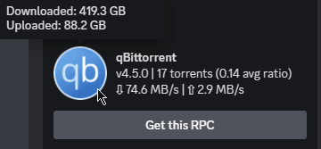
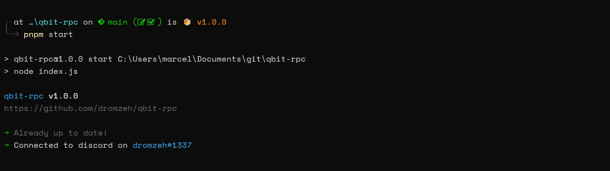

# qbit-rpc

A simple Discord Rich Presence for qBittorrent, tested on Windows & Linux.

<p align = "center">
    <a href="https://buymeacoffee.com/marcelmd" alt="buymeacoffee">
        </a>
    <a href="https://nodejs.org" alt="node js">
        </a>
    <a href = "https://pnpm.io/installation" alt = "pnpm">
        </a>
    <a href = "https://javascript.com" alt = "javascript">
        </a>
</p>

<p align = "center">
    
</p>

<details>
  <summary>CLI Image</summary>
<p>
    
</p>
</details>

## Installation

[pnpm](https://pnpm.js.org/) and [Node.js](https://nodejs.org/) are required to run this program.

Installing pnpm using npm:

```bash
npm i -g pnpm
```

## Usage

1. Make sure you have **enabled the Web UI** in qBittorrent. **qBittorrent MUST be open before starting the Rich Presence.**
2. You not need to modify anything but `config/config.json`, this is to include the `ip`, `port`, `username` and `password` of your qBittorrent WebUI instance.
3. The `filterInactiveUL` / `filterInactiveDL` value is what controls if 'inactive' torrents are shown or not. (`default: false`)
4. `pnpm start` to start the client ( + `pnpm i` to install dependencies if you haven't already)
5. If you are using defaults, the RPC will automatically connect to the qBittorrent WebUI on `127.0.0.1:8080` and will update your status every 10 seconds.

* If the repository is cloned, the program will check for updates on startup.

## Issues

If you have any issues, please open an issue, or contact me on Discord: `dromzeh#1337`.

## Contributing

Pull requests are welcome and appreciated.

## License

Licensed under [MIT](https://mit.dromzeh.dev) © 2023 [dromzeh](https://dromzeh.dev)
